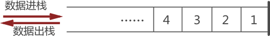
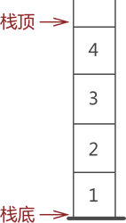

# Stack（栈）

栈是用来存储逻辑关系为 "一对一" 数据的线性存储结构。栈对数据 "存" 和 "取" 的过程有特殊的要求：



- 栈只能从表的一端存取数据，而另一端是封闭的
- 在栈中无论是存数据还是取数据，都必须遵循"先进后出"的原则，即最先进栈的元素最后出栈

从图中数据的存储状态可判断出，元素 1 是最先进的栈。因此，当需要从栈中取出元素 1 时，根据"先进后出"的原则，需提前将元素 3 和元素 2 从栈中取出，然后才能成功取出元素 1



## 进栈和出栈

基于栈结构的特点，在实际应用中，通常只会对栈执行以下两种操作：

- 向栈中添加元素，此过程被称为"进栈"（入栈或压栈）；
- 从栈中提取出指定元素，此过程被称为"出栈"（或弹栈）；

## 栈的实现

栈是一种 "特殊" 的线性存储结构，因此栈的具体实现有以下两种方式：

- 顺序栈：采用顺序存储结构可以模拟栈存储数据的特点，从而实现栈存储结构；
- 链栈：采用链式存储结构实现栈结构；

```
两种实现方式的区别，仅限于数据元素在实际物理空间上存放的相对位置，顺序栈底层采用的是数组，链栈底层采用的是链表
```
